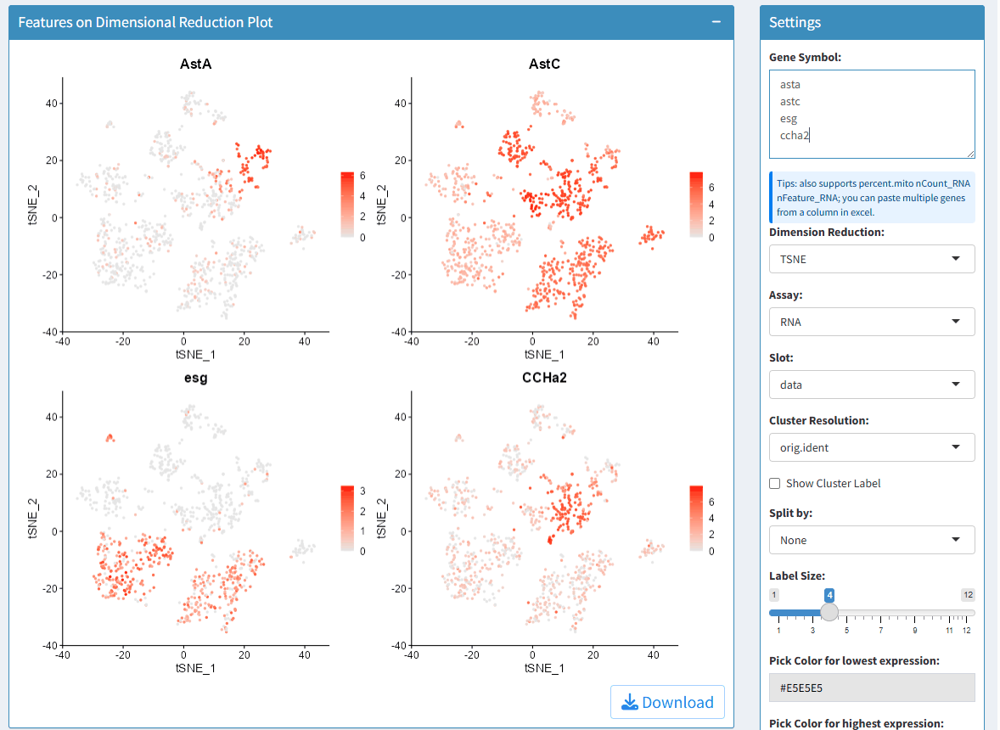

<!-- README.md is generated from README.Rmd. Please edit that file -->

# SeuratExplorer

<!-- badges: start -->

[](https://lifecycle.r-lib.org/articles/stages.html#experimental)
<!-- badges: end -->

> 此R包参考了开源程序[Hla-Lab/SeuratExplorer](https://github.com/rwcrocker/SeuratExplorer/).

> An interactive R shiny application for exploring scRNAseq data
> processed in Seurat

> **本质上就是把R包`Seurat`里的部分绘图工具和差异分析工具进行可视化！**

## Installation

You can install the development version of `SeuratExplorer` like so:

``` r
if(!require(devtools)){install.packages("devtools")}
install_github("fentouxungui/SeuratExplorer")
```

**建议将各个软件包升级到最新版本！否则可能出现兼容问题**

Run App:

``` r
library(SeuratExplorer)
launchSeuratExplorer()
```

## Functions

### Load data

- support data processed by Seurat V5 and older versions. it may takes a
  while for loading data.


### Cell Meta

- 支持下载cell meta信息，可用于统计特定分辨率下的细胞比例。


### Dimplot

- 支持选择Dimension Reductions

- 支持选择不同的细胞分群方案

- 支持split

- 支持调整图像长宽比

- 支持是否显示cluster label

- 支持调整label大小

- 支持调整点的大小

Example plots:


### FeaturePlot

- 支持输入多个基因名，以逗号分割，基因名可不区分大小写。

- 支持选择Dimension Reductions

- 支持split

- 支持自定义最大和最小表达值对应的颜色

- 支持调整图像长宽比

- 支持调整点的大小



### VlnPlot

- 支持输入多个基因名，以逗号分割，基因名可不区分大小写。

- 支持选择不同的细胞分群方案

- 支持split

- 支持stack和flip图像, 和指定颜色的映射

- 支持自定义最大和最小表达值对应的颜色

- 支持调整点的大小

- 支持调整x轴和y轴label的字体大小

- 支持调整图像长宽比

``` r
knitr::include_graphics("inst/extdata/www/Vlnplot-1.png")
```


``` r
knitr::include_graphics("inst/extdata/www/Vlnplot-2.png")
```


``` r
knitr::include_graphics("inst/extdata/www/vlnplot-splited-1.png")
```


``` r
knitr::include_graphics("inst/extdata/www/vlnplot-splited-2.png")
```


### DotPlot

- 支持输入多个基因名，以逗号分割，基因名可不区分大小写。

- 支持选择不同的细胞分群方案和指定所使用的clusters

- 支持split

- 支持对cluster/idents进行聚类

- 支持旋转坐标轴lable和旋转整个图像

- 支持调整点的大小和透明度

- 支持调整x轴和y轴label的字体大小

- 支持调整图像长宽比

``` r
knitr::include_graphics("inst/extdata/www/Dotplot-1.png")
```


``` r
knitr::include_graphics("inst/extdata/www/dotplot-splited-1.png")
```


### DoHeatmap

- 支持输入多个基因名，以逗号分割，基因名可不区分大小写。

- 支持选择不同的细胞分群方案

- 支持调整cluster label的大小、xy轴的位置和旋转角度

- 支持调整Group bar的高度

- 支持调整Group间的间隙大小

- 支持调整基因名的字体大小

- 支持调整图像长宽比

``` r
knitr::include_graphics("inst/extdata/www/Heatmap-1.png")
```


### RidgePlot

- 支持输入多个基因名，以逗号分割，基因名可不区分大小写。

- 支持选择不同的细胞分群方案

- 支持调整列的数目

- 支持Stack和指定颜色的映射

- 支持调整x轴和y轴label的字体大小

- 支持调整图像长宽比

``` r
knitr::include_graphics("inst/extdata/www/ridgeplot-1.png")
```


``` r
knitr::include_graphics("inst/extdata/www/Ridgeplot-2.png")
```


``` r
knitr::include_graphics("inst/extdata/www/Ridgeplot-3.png")
```


### DEGs Analysis

- 支持同时计算所有群的marker基因

- 支持计算指定群之间的差异基因

- 支持先做subset，再计算指定群之间的差异基因

- 支持自定义部分计算参数

- 支持结果下载

``` r
knitr::include_graphics("inst/extdata/www/DEGs-1.png")
```


``` r
knitr::include_graphics("inst/extdata/www/DEGs-2.png")
```


``` r
knitr::include_graphics("inst/extdata/www/DEGs-3.png")
```


``` r
knitr::include_graphics("inst/extdata/www/DEGs-4.png")
```


## 为什么做这个R包

> 目前还没有很好的用于可视化Seurat分析结果的工具，当生物信息分析员将结果交给用户后，用户如果没有任何R语言基础，还是比较难去自行进行结果检索和再分析，这个R包可以帮助此类用户进行交互，实现分析结果的可视化，方便用户自行出图。用户仅需要在自己电脑上配置好R和Rstudio，然后安装运行此软件即可，无需其他操作。

## Session Info

``` r
sessionInfo()
#> R version 4.3.0 (2023-04-21 ucrt)
#> Platform: x86_64-w64-mingw32/x64 (64-bit)
#> Running under: Windows 10 x64 (build 19045)
#> 
#> Matrix products: default
#> 
#> 
#> locale:
#> [1] LC_COLLATE=Chinese (Simplified)_China.utf8 
#> [2] LC_CTYPE=Chinese (Simplified)_China.utf8   
#> [3] LC_MONETARY=Chinese (Simplified)_China.utf8
#> [4] LC_NUMERIC=C                               
#> [5] LC_TIME=Chinese (Simplified)_China.utf8    
#> 
#> time zone: Asia/Shanghai
#> tzcode source: internal
#> 
#> attached base packages:
#> [1] stats     graphics  grDevices utils     datasets  methods   base     
#> 
#> loaded via a namespace (and not attached):
#>  [1] compiler_4.3.0  fastmap_1.1.1   cli_3.6.1       tools_4.3.0    
#>  [5] htmltools_0.5.5 rstudioapi_0.14 yaml_2.3.7      rmarkdown_2.22 
#>  [9] highr_0.10      knitr_1.43      xfun_0.39       digest_0.6.31  
#> [13] rlang_1.1.3     evaluate_0.21
```
